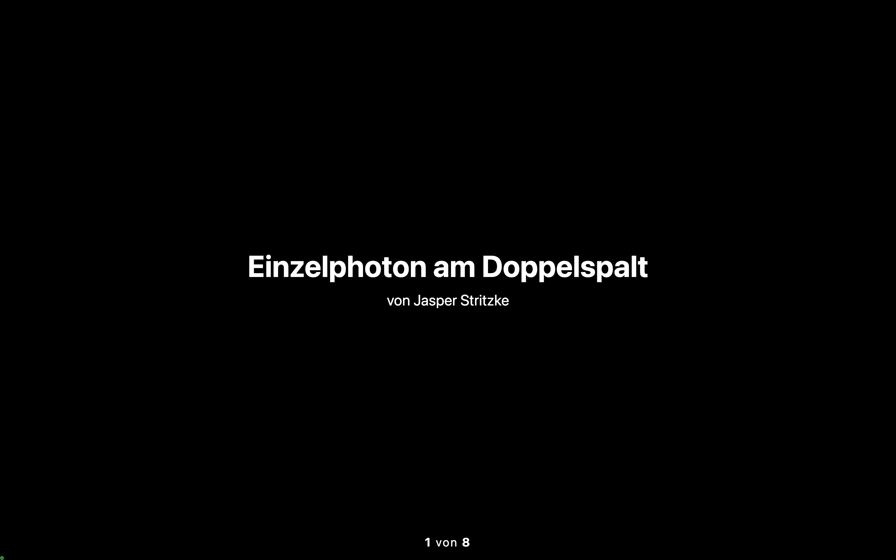
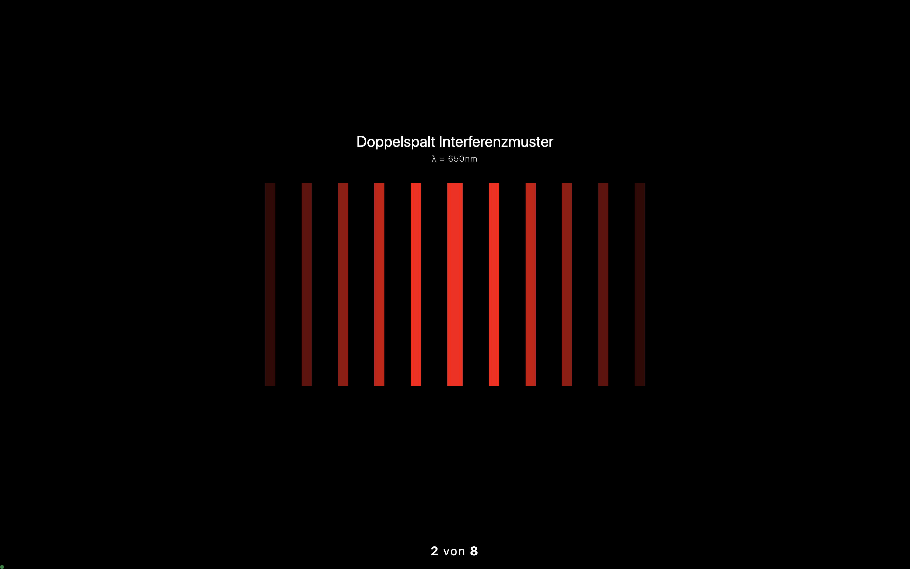
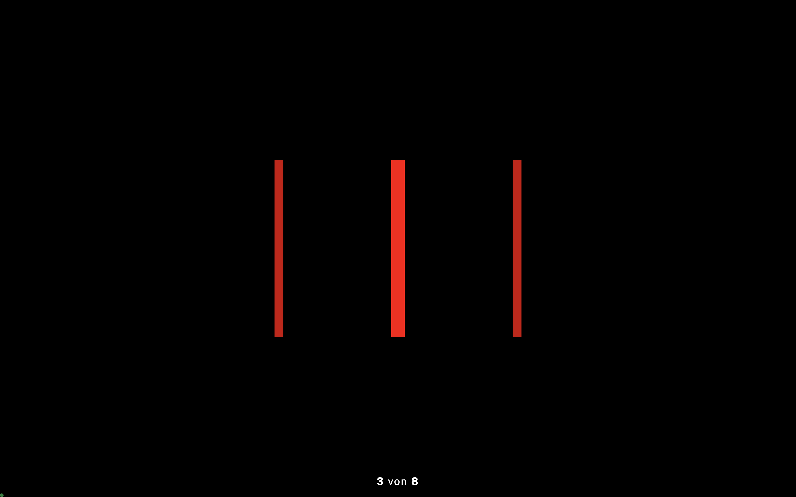
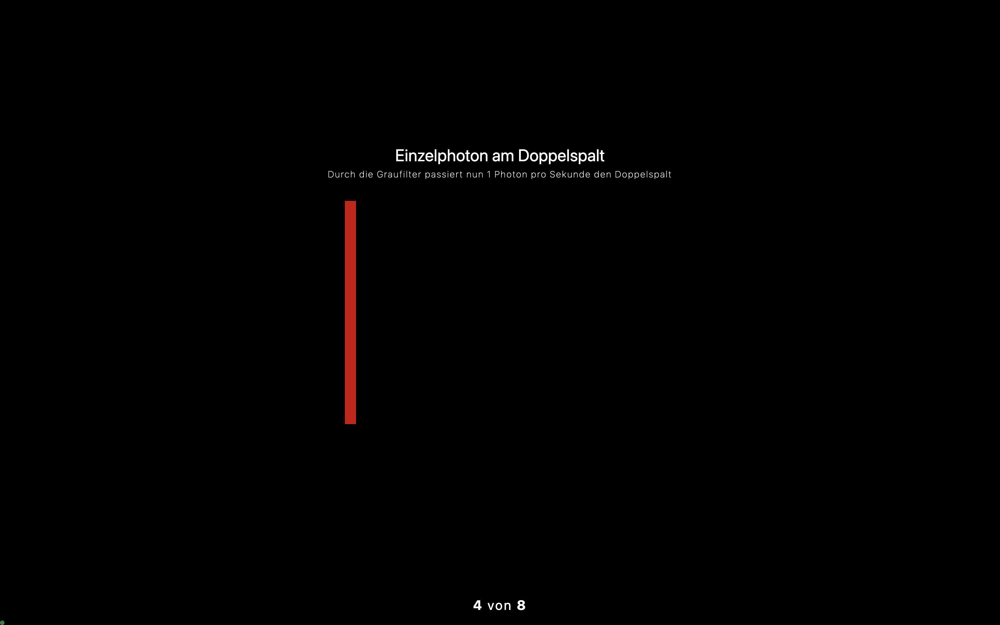
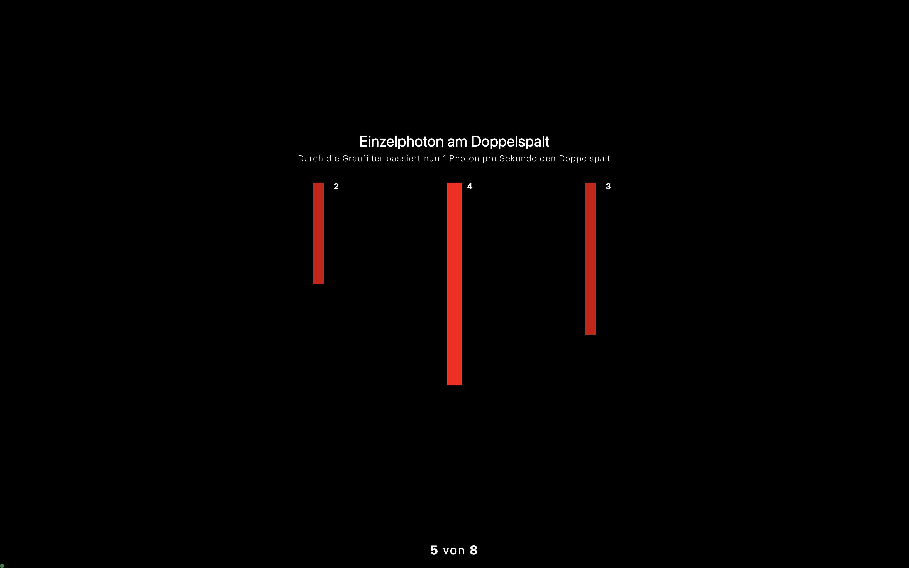
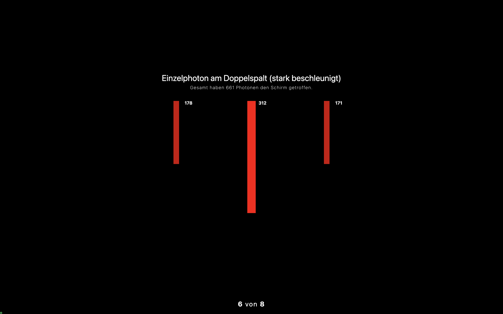
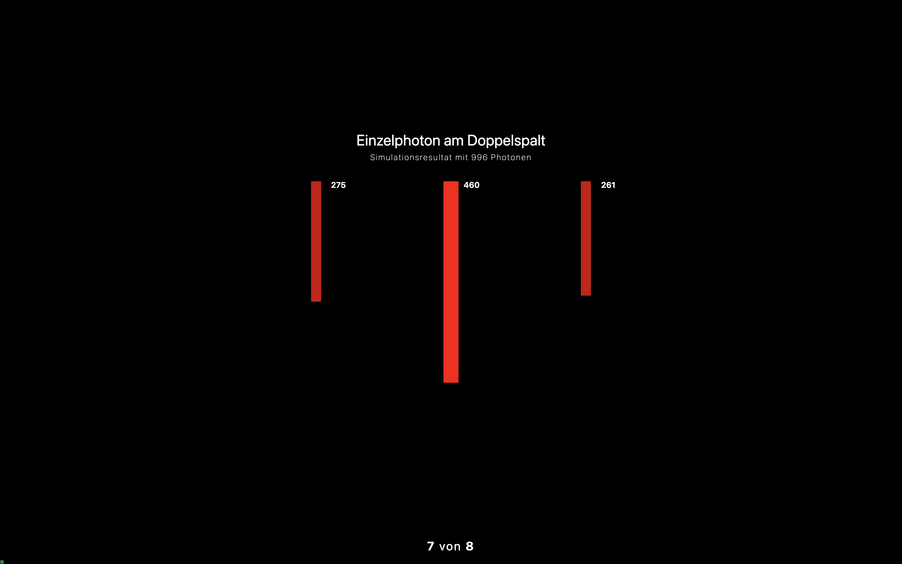
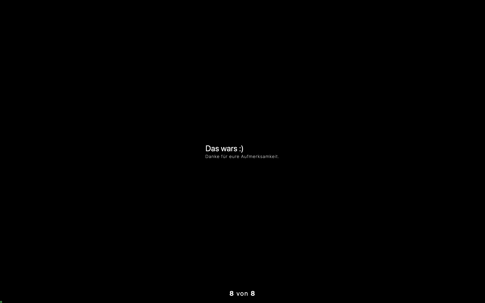

# Einzelhoton am Doppelspalt

#### Diese Website ist eine kleine "Präsentation", die ich für eine Physikstunde gebastelt habe. Viel Zeit hatte ich für den Code nicht, deswegen ist der leider etwas "geschmiert"

---

##### Hier gibt es nochmal die einzelnen Slides anzusehen :)

